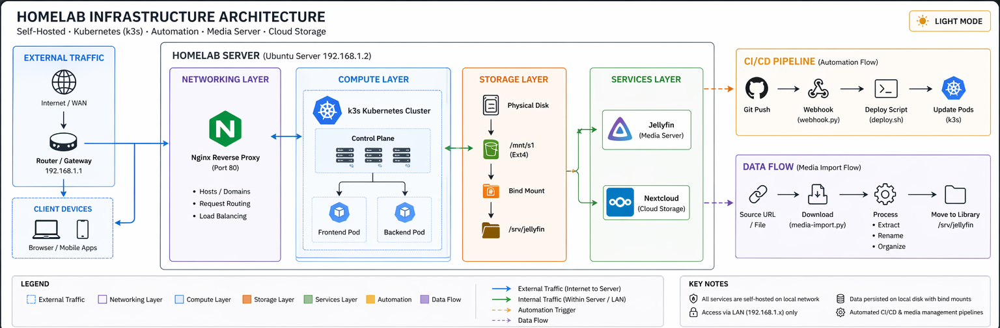
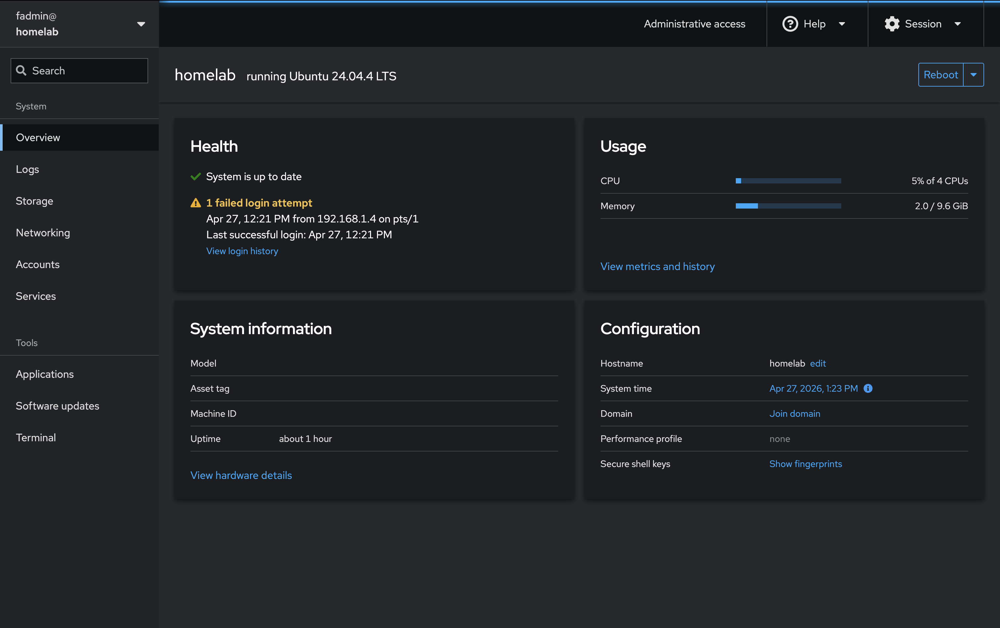
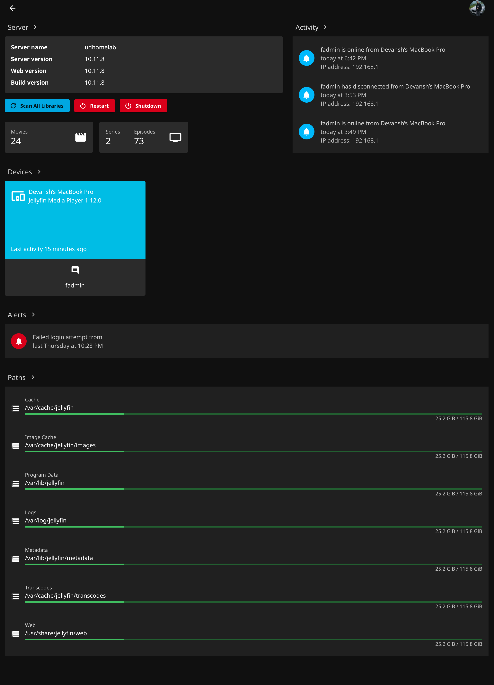
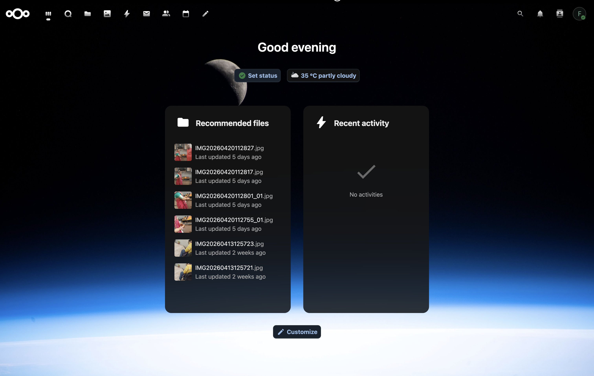

# 🏠 Homelab Infrastructure (DevOps + Self-Hosting)

A self-hosted homelab built on Ubuntu, featuring Kubernetes (k3s), automation pipelines, media streaming, and cloud storage.

---

## 🚀 Overview

This project showcases a real-world homelab where services are deployed, automated, and managed using DevOps practices. It includes container orchestration, reverse proxy routing, shared storage, and media automation.

---

## 🧰 Tech Stack

- Ubuntu 24.04 LTS
- k3s (Kubernetes)
- containerd
- Nginx (Reverse Proxy)
- Python & Bash (Automation)
- Jellyfin (Media Server)
- Nextcloud (Cloud Storage)

---

## 🏗️ Architecture

<picture>
  <source media="(prefers-color-scheme: dark)" srcset="architecture/diagram-dark.png">
  
</picture>

---

## 🔄 Automation Workflows

### CI/CD Pipeline
Git Push → webhook.py → deploy.sh → Kubernetes (k3s)

### Media Import Pipeline
URL/File → Download → Extract → Rename → Move → Jellyfin

---

## 💾 Storage Architecture

- `/mnt/s1` → Main storage (used by Nextcloud)
- `/srv/jellyfin` → Bind mount for media access
- Shared storage with controlled permissions

---

## 🌐 Networking

- Local LAN: `192.168.x.x`
- Reverse proxy: Nginx (Port 80)
- Services exposed internally via ports

---

## 📸 Screenshots

---

## 🔗 Related Projects

- [Media Import Tool](https://github.com/DU-0408/media-import-tool)

---

## ⚠️ Notes

- Sensitive data removed
- Sample configurations provided
